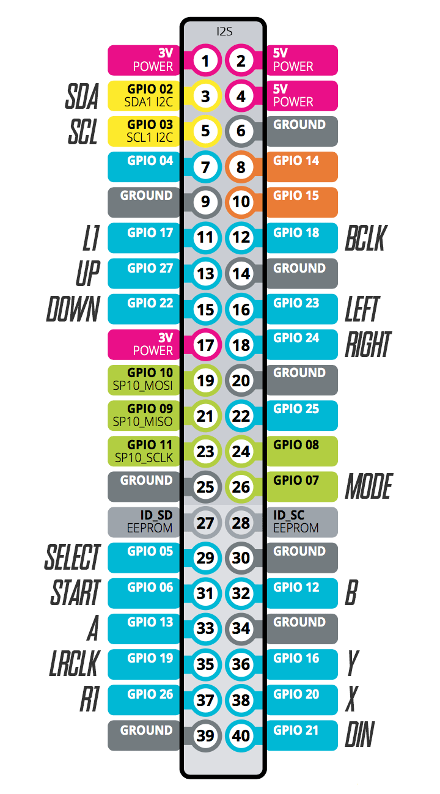

# MM Gameboy Zero Setup

This setup script is for builds using RetroPie 4.4, GPIO controller, and i2s for audio.

## What's in the box

1. Optimized [config.txt](settings/config.txt) which includes overclocking
1. Download Gameboy Zero splashscreen by [AJRedfern](https://www.sudomod.com/forum/viewtopic.php?f=8&t=1440)
1. Fix for splashscreen audio
1. Install the gbz35 theme and set it as default
1. Install the gbz35-dark
1. Disble fsck on boot
1. Disable 'wait for network' on boot
1. Install [retrogame](https://learn.adafruit.com/retro-gaming-with-raspberry-pi/adding-controls-software) and copy config
1. Install [i2s script](https://learn.adafruit.com/adafruit-max98357-i2s-class-d-mono-amp/raspberry-pi-usage)

---

## Running the installer

1. Download RetroPie from the [official site](https://retropie.org.uk/download/)
1. Flash the .img to an SD card (e.g. using [Etcher](https://etcher.io/) or [Apple Pi Baker](https://www.tweaking4all.com/software/macosx-software/macosx-apple-pi-baker/))
1. Enable WIFI and SSH
1. Connect to the GBZ through SSH
1. `git clone https://github.com/sixteenbit/marky-malarky-install.git`
1. `cd marky-malarky-install`
1. `sudo chmod +x Setup.sh`
1. `sudo ./Setup.sh YES`
1. For Retrogame install, select option number 1
1. Answer any questions during installing but type "N" for any questions asking you to reboot (We'll do that at the end).
1. `sudo reboot now`
1. Post install you can run the i2s script to test that it's working with: `curl -sS https://raw.githubusercontent.com/adafruit/Raspberry-Pi-Installer-Scripts/master/i2samp.sh | bash`

## GPIO setup

## Credits

- Installer script originally built by [Kite](https://github.com/kiteretro/Circuit-Sword) for the Circuit Sword but has been re-purposed for Gameboy Zero.
- MintyComboScript is a modified version of [HoolyHoo's](https://github.com/HoolyHoo/MintyComboScript).
- Splashscreen was created by [AJRedfern](https://www.sudomod.com/forum/viewtopic.php?f=8&t=1440)